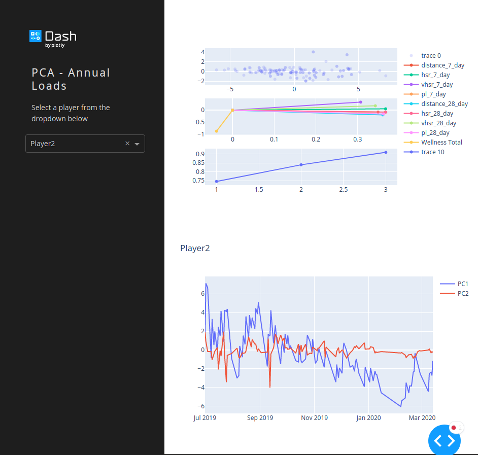

# Player Monitoring Dashboard 

Player monitoring dashboard using plotly and dash. [PCA_class](PCA_class.py) was created to process the raw data we use from GPS and daily monitoring tools. This is then integrated into the Dash based web app to create inidividual player monitoring visualizations.  
Each players scree graph needs to be looked at indivdually to assess how to interpret each principle component for each player.  

